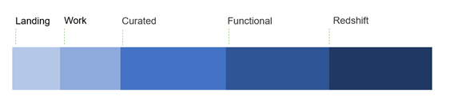
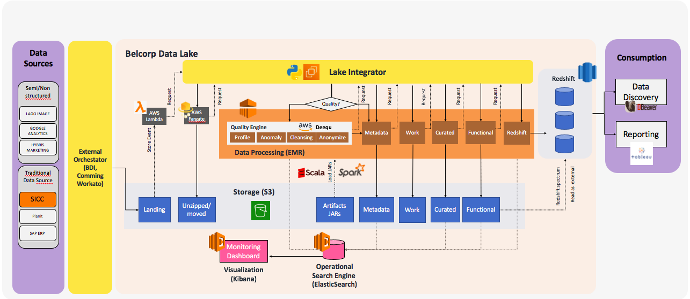

# *DATA OPS*

*A short description of the project*

## Table of Contents

* [1. Technical Architecture](1-Technical-Architecture)
* [4. Deployment](4-Deployment)
* [5. Repository Overview](5-Repository-Overview)

## 1. Technologies

*Example:*

|AWS|Languages|CI/CD|
|---|---------|-----|
|S3|Python < Version >|Docker|

## 2. Technical Architecture
Data Layers

Datalake integrator Framework

Please more information:

https://confluence.belcorp.biz/display/DA/3.4+-+Guidelines+of+the+Implementation+in+Data+Lake

