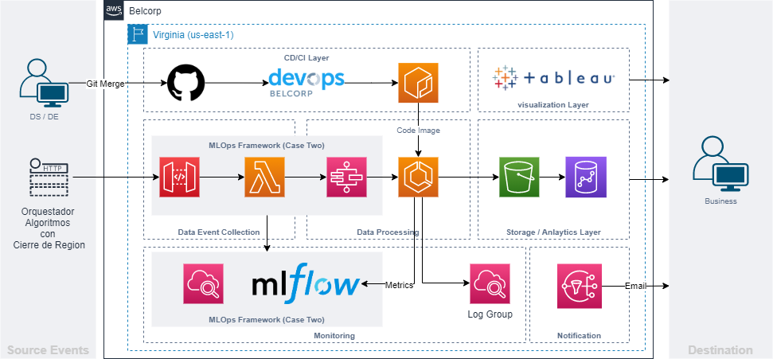
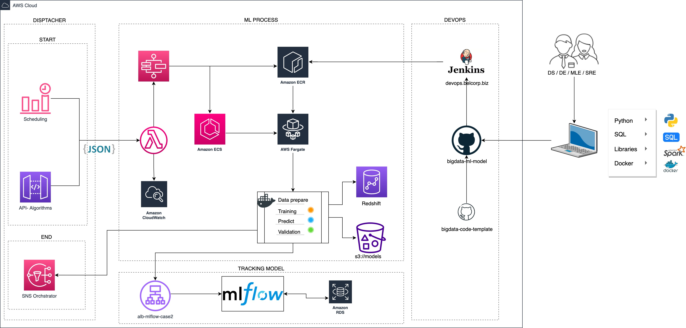

# *Machine Learning Ops*

High-tech toolkit, used for the training, integration and continuous deployment of analytical models (CI/CD/CT), as well as for the experimentation, collection of statistics, traceability, recording and promotion of analytical models.

## Table of Contents

* [1. Technologies](1-Technologies)
* [1. Technical Architecture](1-Technical-Architecture)
* [4. Deployment](4-Deployment)
* [5. Repository Overview](5-Repository-Overview)

## 1. Technologies

*List of the Technologies that the project use*

*Example:*

|AWS|Languages|CI/CD|
|---|---------|-----|
|S3|Python < Version >|Docker|

## 2. Technical Architecture
*In this section explain the deployed train/predict architecture that the aplication has.*
*We can add the train/predict architecture diagram.*

MLOPS Architecture Framework

Please more information:

https://confluence.belcorp.biz/display/DEC/4.2+ML+Pipelines+-+MLOps

## 3. Deployment

Enviroments:
- BELCORP {PRD, QAS}
- POC {DEV} 